---
## Front matter
title: "Лабораторная работа №7"
subtitle: "Команды безусловного и условного переходов в Nasm. Программирование ветвлений."
author: "Краснопер Данила Олегович"

## Generic otions
lang: ru-RU
toc-title: "Содержание"

## Bibliography
bibliography: bib/cite.bib
csl: pandoc/csl/gost-r-7-0-5-2008-numeric.csl

## Pdf output format
toc: true # Table of contents
toc-depth: 2
fontsize: 12pt
linestretch: 1.5
papersize: a4
documentclass: scrreprt
## I18n polyglossia
polyglossia-lang:
  name: russian
  options:
	- spelling=modern
	- babelshorthands=true
polyglossia-otherlangs:
  name: english
## I18n babel
babel-lang: russian
babel-otherlangs: english
## Fonts
mainfont: PT Serif
romanfont: PT Serif
sansfont: PT Sans
monofont: PT Mono
mainfontoptions: Ligatures=TeX
romanfontoptions: Ligatures=TeX
sansfontoptions: Ligatures=TeX,Scale=MatchLowercase
monofontoptions: Scale=MatchLowercase,Scale=0.9
## Biblatex
biblatex: false
biblio-style: "gost-numeric"
biblatexoptions:
  - parentracker=true
  - backend=biber
  - hyperref=auto
  - language=auto
  - autolang=other*
  - citestyle=gost-numeric
## Pandoc-crossref LaTeX customization
figureTitle: "Рис."
tableTitle: "Таблица"
listingTitle: "Листинг"
lofTitle: "Список иллюстраций"
lotTitle: "Список таблиц"
lolTitle: "Листинги"
## Misc options
indent: true
header-includes:
  - \usepackage{indentfirst}
  - \usepackage{float} # keep figures where there are in the text
  - \floatplacement{figure}{H} # keep figures where there are in the text
---

# Цель работы

Изучение команд условного и безусловного переходов. Приобретение навыков написания программ с использованием переходов. Знакомство с назначением и структурой файла листинга.

# Выполнение лабораторной работы

1) Я создал каталог lab7 и внутри создал файл lab7-1.asm

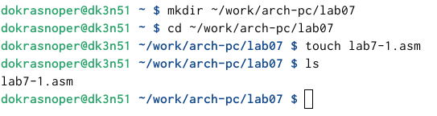{ #fig:001 width=70% }

2) Я ввел в файл текст программы и запустил его.

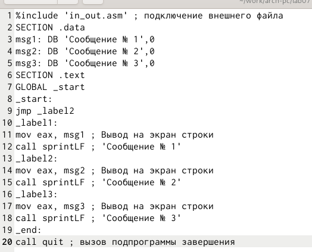{ #fig:002 width=70% }

3) Я создал исполняемый файл и запустил его. Результат соответствовал нужному.

{ #fig:003 width=70% }

4)Я изменил текст программы чтобы выводился нужный ответ и создал исполняемый файл.

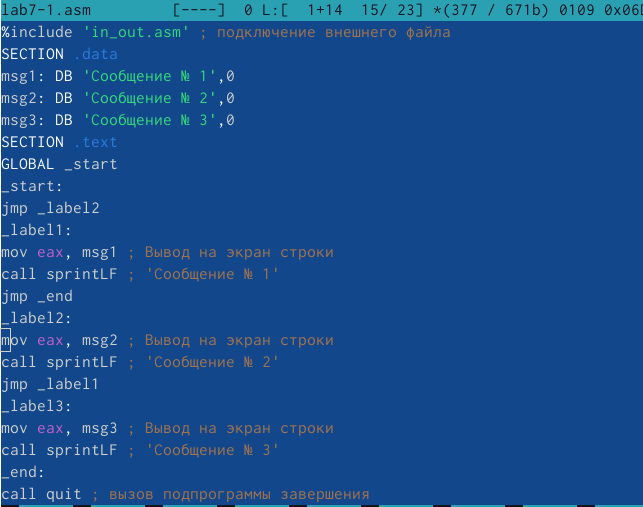{ #fig:004 width=70% }

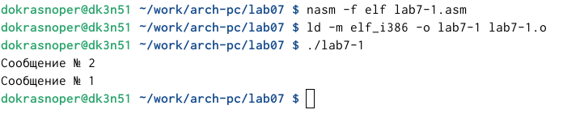{ #fig:005 width=70% }

5)Я изменил текст программы чтобы сначала выводило сообщение 3,затем 2, затем 1.

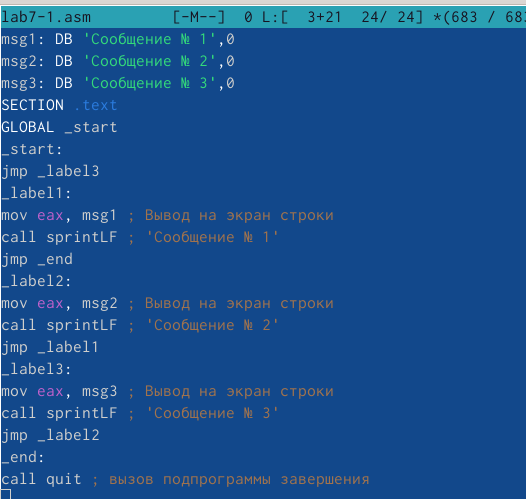{ #fig:006 width=70% }

6) Запустил программу и проверил ее работу.

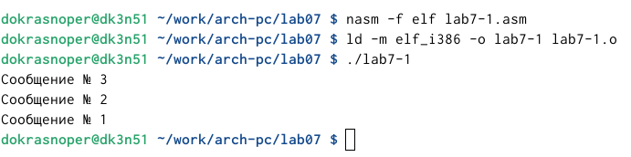{ #fig:007 width=70% }

7) Я создал файл lab7-2.asm и написал текст программы.

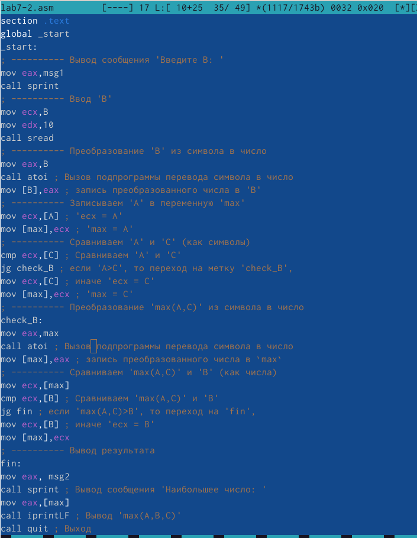{ #fig:008 width=70% }

8) Я ввел два разных числа чтобы проверить как работает программа. 

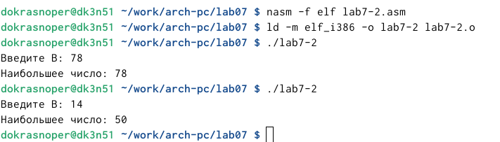{ #fig:09 width=70% }

9) Я создал файл листинга lab7-2.lst и открыл его.

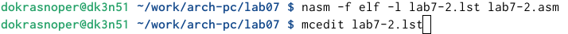{ #fig:010 width=70% }

10) Проанализировав файл, я понял как он работает и какие значения выводит.

1) Эта строка находится на 21 месте, ее адрес "00000101", Машинный код - В80A000000, а mov eax,B - исходный текст программы, означающий что в регистр eax мы вносим значения переменной B.

{ #fig:011 width=70% }

2) Эта строка находится на 35 месте, ее адрес "00000135", Машинный код - E862FFFFFF, а call atoi - исходный текст программы, означающий что символ лежащий в строке выше переводится в число.

{ #fig:012 width=70% }

3) Эта строка находится на 47 месте, ее адрес "00000163", Машинный код - A100000000, а mov eax,max - исходный текст программы, означающий что число хранившееся в переменной max записывается в регистр eax.

{ #fig:013 width=70% }

11) В строке mov eax,max я убрал max и попробовал создать файл. Должно было выдать ошибку, так как для программы нужно два операнда. Но исходный файл автоматически исправлялся и прервать это было не возможно, из-за чего терминал ошибку не выдал.

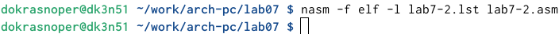{ #fig:014 width=70% }

# Самостоятельная работа.

1) Я написал программу для нахождения меньшего из трех чисел. Для большего удобства я сделал ввод чисел с клавиатуры.У меня девятый вариант, поэтому числа были :24,98,15. Программа вывела меньшее из этих чисел.

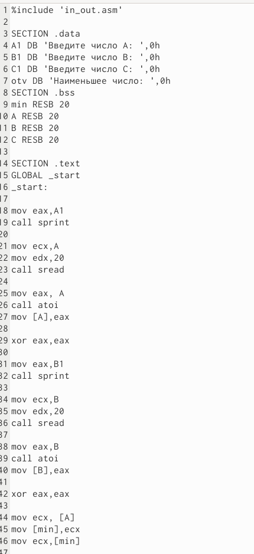{ #fig:016 width=70% }

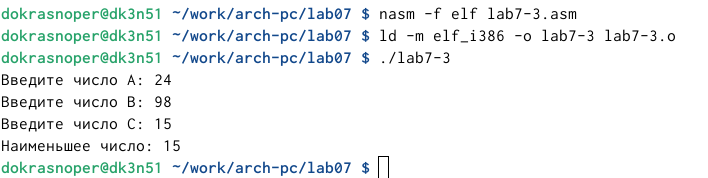{ #fig:017 width=70% }

2) Я написал программу, чтобы она вычисляла выражение при введенных Х и А. Так как у меня 9 вариант, то программа написана для 9 варианта.

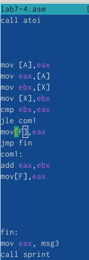{ #fig:018 width=70% }

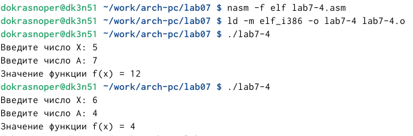{ #fig:019 width=70% }

# Вывод

Я изучил команды условного и безусловного перехода. Приобрел навыки написания программ с переходами.
