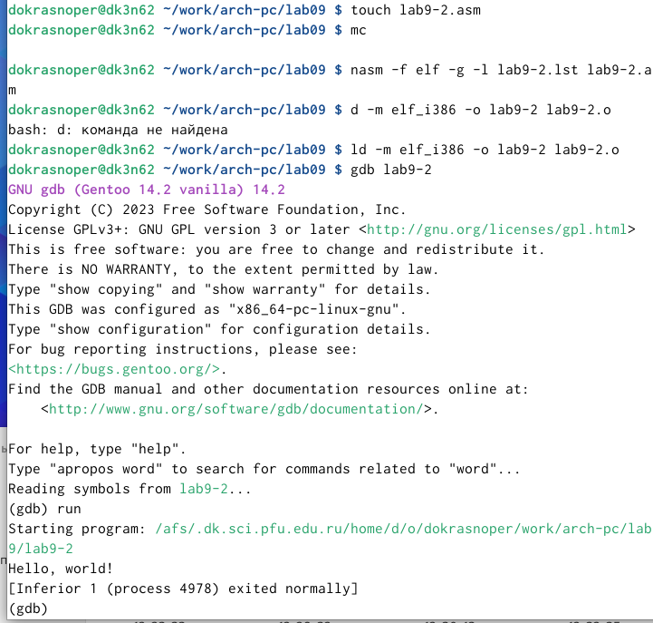
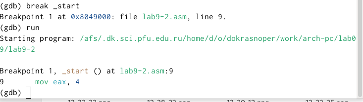
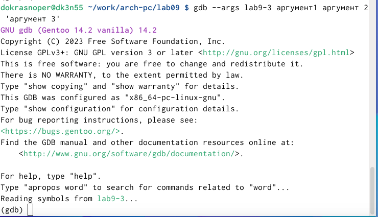

---
## Front matter
title: "Отчет по лабораторной работе №9"
subtitle: "Понятие подпрограммы. Отладчик GDB"
author: "Краснопер Данила Олегович"

## Generic otions
lang: ru-RU
toc-title: "Содержание"

## Bibliography
bibliography: bib/cite.bib
csl: pandoc/csl/gost-r-7-0-5-2008-numeric.csl

## Pdf output formatф
toc: true # Table of contents
toc-depth: 2
lof: true # List of figures
lot: true # List of tables
fontsize: 12pt
linestretch: 1.5
papersize: a4
documentclass: scrreprt
## I18n polyglossia
polyglossia-lang:
  name: russian
  options:
	- spelling=modern
	- babelshorthands=true
polyglossia-otherlangs:
  name: english
## I18n babel
babel-lang: russian
babel-otherlangs: english
## Fonts
mainfont: PT Serif
romanfont: PT Serif
sansfont: PT Sans
monofont: PT Mono
mainfontoptions: Ligatures=TeX
romanfontoptions: Ligatures=TeX
sansfontoptions: Ligatures=TeX,Scale=MatchLowercase
monofontoptions: Scale=MatchLowercase,Scale=0.9
## Biblatex
biblatex: false
biblio-style: "gost-numeric"
biblatexoptions:
  - parentracker=true
  - backend=biber
  - hyperref=auto
  - language=auto
  - autolang=other*
  - citestyle=gost-numeric
## Pandoc-crossref LaTeX customization
figureTitle: "Рис."
tableTitle: "Таблица"
listingTitle: "Листинг"
lofTitle: "Список иллюстраций"
lotTitle: "Список таблиц"
lolTitle: "Листинги"
## Misc options
indent: true
header-includes:
  - \usepackage{indentfirst}
  - \usepackage{float} # keep figures where there are in the text
  - \floatplacement{figure}{H} # keep figures where there are in the text
---

# Цель работы

Приобретение навыков написания программ с использованием подпрограмм.
Знакомство с методами отладки при помощи GDB и его основными возможностями

# Выполнение лабораторной работы

1) Я создал каталог lab9 и создал файл lab9-1.asm

{ #fig:001 width=70% }

2)Я ввел текст листинга в файл и запустил программу.

{ #fig:002 width=70% }

{ #fig:003 width=70% }

3) Я изменил текст программы, чтобы она решала выражение f(g(x)).

{ #fig:004 width=70% }

{ #fig:005 width=70% }

4)Я создал файл lab9-2.asm и вписал туда программу.

{ #fig:006 width=70% }

5)Я загрузил и запустил файл второй программы в отладчик gdb.

{ #fig:007 width=70% }

6) Я поставил брекпоинт на метку _start и запустил программу.

{ #fig:008 width=70% }

7)Я просмотрел дисассимплированный код программы начиная с метки.

{ #fig:009 width=70% }

8) С помощью команды я переключился на intel'овское отображение синтаксиса. Отличие заключается в командах, в диссамилированном отображении в командах используют % и $, а в Intel отображение эти символы не используются. На такое отображение удобнее смотреть.

{ #fig:010 width=70% }

9) Для удобства я включил режим псевдографики.

{ #fig:011 width=70% }

10) Я посмотрел наличие меток и добавил еще одну метку на предпоследнюю инструкцию.

{ #fig:012 width=70% }

11) С помощью команды si я посмотрел регистры и изменил их.

{ #fig:013 width=70% }

{ #fig:014 width=70% }

12) С помощью команды я посмотрел значение переменной msg1.

{ #fig:015 width=70% }

13) Следом я посмотрел значение второй переменной msg2.

{ #fig:016 width=70% }

14) С помощью команды set я изменил значение переменной msg1.

{ #fig:017 width=70% }

15)Я изменил переменную msg2.

{ #fig:018 width=70% }

16)Я вывел значение регистров ecx и eax.

{ #fig:019 width=70% }

17) Я изменил значение регистра ebx. Команда выводит два разных значения так как в первый раз мы вносим значение 2, а во второй раз регистр равен двум, поэтому и значения разные.

{ #fig:020 width=70% }

18) Я завершил работу с файлов вышел.

{ #fig:021 width=70% }

19) Я скопировал файл lab8-2.asm и переименовал его. Запустил файл в отладчике и указал аргументы.

{ #fig:022 width=70% }

20) Поставил метку на _start и запустил файл.

{ #fig:023 width=70% }

21)Я проверил адрес вершины стека и убедился что там хранится 5 элементов.

{ #fig:024 width=70% }

22) Я посмотрел все позиции стека. По первому адрему хранится адрес, в остальных адресах хранятся элементы. Элементы расположены с интервалом в 4 единицы, так как стек может хранить до 4 байт, и для того чтобы данные сохранялись нормально и без помех, компьютер использует новый стек для новой информации.

{ #fig:025 width=70% }

# Самостоятельная работа

1) Я преобразовал программу из лабораторной работы №8 и реализовал вычисления как подпрограмму.

{ #fig:026 width=70% }

{ #fig:027 width=70% }

2) Я переписал программу и попробовал запустить ее чтобы увидеть ошибку. Ошибка была арифметическая, так как вместо 25,программа выводит 10.

{ #fig:028 width=70% }

{ #fig:029 width=70% }

После появления ошибки, я запустил программу в отладчике.

{ #fig:030 width=70% }

Я открыл регистры и проанализировал их, понял что некоторые регистры стоят не на своих местах и исправил это.

{ #fig:031 width=70% }

Я изменил регистры и запустил программу, программа вывела ответ 25, то есть все работает правильно.

{ #fig:032 width=70% }

# Вывод{.unnumbered}

Я приобрел навыки написания программ использованием подпрограмм. Познакомился с методами отладки при помозь GDB и его основными возможностями.

